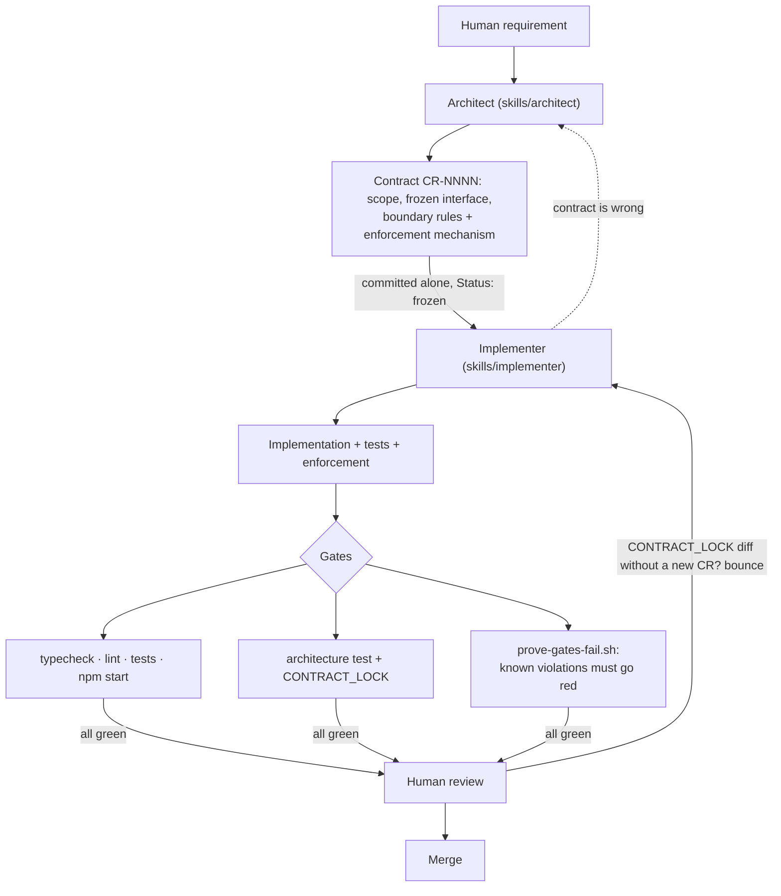

# ContractRail

**Boundaries the build enforces, not the prompt.**

[](https://github.com/mohammed-shanid/contract-rail/actions/workflows/ci.yml)

Freeze the interface. Let agents implement against it. If one crosses a
boundary, the build fails — not a reviewer, not a prompt, the build.

---

## 1. What it is

A small method for letting coding agents work on a codebase without
crossing each other's boundaries, plus a runnable example proving the
boundaries are enforced by the build. Four parts:

| Part | Where | What it does |
| --- | --- | --- |
| **Contracts** | `contracts/` | A frozen scope + interface + boundary-rules table. Every rule must name the mechanism that enforces it. |
| **Agent roles** | `skills/`, `AGENTS.md` | Architect writes the contract; implementer builds against it. Roles are defined by what they may *not* do. |
| **Machine-enforced checks** | `examples/product-catalog/` | ESLint rule + architecture test + hash lock. Crossing a boundary fails lint *and* a test. |
| **Validation** | `scripts/`, `.github/workflows/ci.yml` | Gates run in CI, and a proof script applies known violations to confirm the gates still go red. |

Nothing here invents multi-agent workflows or agent instruction files. It
stands on [AGENTS.md](https://agents.md) and
[Agent Skills](https://agentskills.io) (see §8).

## 2. Why it exists

Agent-instruction templates and multi-agent handoff repos already exist,
and several are good. Most stop at the prompt: they *tell* the agent not
to cross the boundary. This repo assumes the agent will cross it anyway —
under time pressure, after a context reset, or because the quick fix was
genuinely quicker — and makes the build refuse.

What this adds over a prompt-only approach:

- an **enforcement column** in the contract — a rule with no mechanism is
  not allowed in the template
- a **runnable example** whose gates go red on a committed violation patch
- a **hash lock** that makes silent interface changes impossible
- a **CI job** that re-applies the known violations and requires red

## 3. Workflow



The handoffs are files, not messages: the architect hands off a committed
contract; the implementer hands off a diff plus pasted gate output.
`docs/agent-roles.md` defines each role by what it may not do.

## 4. Proof: bad architecture → build fails

The example enforces this dependency direction:

```text
UI  (src/ui/)
 ↓  imports only the interface
Repository interface  (src/contracts/ — frozen, hashed)
 ↑  implemented by
Data source  (src/data/)
```

and rejects this:

```text
UI  →  Data source          (direct import; bypasses the interface)
```

`src/main.ts` is the one composition root allowed to wire the two together.

**Valid tree** (`npm run gates` + `npm start`):

```text
✓ typecheck
✓ lint
✓ tests          4 files, 14 tests
✓ npm start      renders the page
```

**Intentional violation** — apply the committed patch that makes the UI
read the data source directly:

```sh
cd examples/product-catalog
patch -p1 < violations/ui-bypasses-repository.patch
```

```text
$ npm run lint
src/ui/catalogPage.ts
  3:1  error  '../data/inMemoryCatalogRepository.ts' import is restricted from being used by a pattern.
       CR-0001 rule 1: this layer may not import src/data. Depend on the CatalogRepository
       interface from src/contracts and let src/main.ts inject the implementation

$ npx vitest run test/architecture.test.ts        # still fails with ESLint disabled
 × rule 1+2: only src/main.ts and src/data may import src/data
   + Received [ "src/ui/catalogPage.ts imports \"../data/inMemoryCatalogRepository.ts\"" ]
```

```text
✗ lint
✗ architecture test
```

Undo with `patch -R -p1 < violations/ui-bypasses-repository.patch`. A
second patch, `contract-edited-without-cr.patch`, shows the frozen layer
refusing a silent interface change (rules 3 and 4 fail).

Output above is real, with paths shortened and lines wrapped. The
`prove-gates-fail` CI job applies both patches to a scratch copy on every
push and fails unless **both** lint and the architecture test go red —
so a gate that quietly stops enforcing is caught too.

## 5. Quick start

```sh
git clone https://github.com/mohammed-shanid/contract-rail.git
cd contract-rail/examples/product-catalog
npm ci
npm run gates                       # typecheck + lint + tests
npm start                           # renders the catalog page to stdout
../../scripts/prove-gates-fail.sh   # applies each violation patch, requires red
```

Verified on Node 24, locally and in CI. Node 22.18+ has the same native
TypeScript support and should work, but has not been run here.

Then read `docs/getting-started.md` to break it yourself and write your
own contract.

## 6. How it works

**The contract** (`contracts/CR-0001-catalog-repository.md`) freezes the
`CatalogRepository` interface and states four rules, each with its
enforcement mechanism:

| # | Rule | Enforced by |
| - | --- | --- |
| 1 | `src/ui/**` must not import `src/data/**` | ESLint `no-restricted-imports` + `test/architecture.test.ts` |
| 2 | Only `src/main.ts` and `src/data/**` may import `src/data/**` | same two |
| 3 | `src/contracts/**` imports nothing outside itself | same two |
| 4 | `src/contracts/**` cannot change without a superseding CR | SHA-256 `CONTRACT_LOCK` checked by the architecture test |

**Two mechanisms per rule, on purpose.** The lint rule gives editor-time
feedback; the architecture test (~60 lines, walks the import graph with
Node only) survives `eslint-disable`, a deleted ESLint config, or a
dynamic `import()`. An agent under pressure reaches for the first escape
hatch; the second mechanism still fires.

**The lock** is a hash of `src/contracts/*.ts` committed next to it. It
fails locally, in any CI, and in any fork — no hosting configuration
required — and turns an interface change into a visible diff a reviewer
can demand a contract for.

**Scope of the enforcement.** The method is language-independent; the
shipped enforcement is not. It is a TypeScript/JavaScript reference
implementation of the pattern. Equivalent dependency-analysis tools exist
elsewhere (`import-linter` for Python, ArchUnit for the JVM, `depguard`
for Go) but none are exercised in this repo. This is not a cross-language
enforcement framework.

## 7. Repository structure

```text
contracts/       TEMPLATE.md, CR-0001-catalog-repository.md
skills/          architect/SKILL.md, implementer/SKILL.md
examples/product-catalog/
  src/contracts/ frozen; CONTRACT_LOCK hashes it
  src/data/      the only layer that knows about storage
  src/ui/        reducer + page renderer; may not import data
  src/main.ts    composition root; the one file allowed to import data
  test/          unit tests + architecture.test.ts
  violations/    patches that must turn the gates red
scripts/         prove-gates-fail.sh, claim-audit.sh
docs/            getting-started, agent-roles, failure-recovery,
                 when-not-to-use, case-study
.github/         ci.yml — example gates, prove-gates-fail, claim-audit
```

Every file above is referenced by a doc, a test, or CI. If you find one
that is not, that is a bug; see `CONTRIBUTING.md`.

## 8. Case study, standards, and limitations

### Built with the method it teaches

The contract for the example was written and committed before any
implementation existed — `git show --stat 96c7465` has no `src/` files in
it. One agent (Claude Opus 5 in Claude Code) then played implementer and
validator in sequence, with the repo owner as reviewer. Along the way the
`npm start` gate caught two runtime failures that typecheck and tests
missed, which is why it is a step in the CI workflow. The full account,
with the ADRs and the raw gate output, is in `docs/case-study.md`.

Honest shape of that claim: **one agent, sequential roles, one human
reviewer.** Not a parallel multi-agent run. The mechanism is the same;
the coordination has not been exercised here at N > 1.

### Standards this stands on

These are different tools, not parallel equals:

- **AGENTS.md** — a single, project-scoped Markdown file that gives any
  coding agent the context for *this* repo. Introduced by OpenAI in
  August 2025; contributed to the Linux Foundation's Agentic AI Foundation
  at its formation on 9 December 2025, alongside MCP and goose. The
  foundation's announcement cited adoption by more than 60,000 open-source
  projects at that date. MIT-licensed. This repo's `AGENTS.md` follows it.
- **Agent Skills (`SKILL.md`)** — a directory-per-capability format for
  reusable, on-demand instructions an agent loads when a task matches.
  Two required frontmatter fields (`name`, `description`) and a Markdown
  body. Originated at Anthropic (October 2025 in Claude); published as an
  open specification at agentskills.io on 18 December 2025, and since read
  by Claude Code, Codex CLI, Cursor, VS Code and others. It is not a
  per-project file the way `AGENTS.md` is; it is portable across projects
  and tools. `skills/architect` and `skills/implementer` follow the spec.

Dates and figures above are as reported in the Linux Foundation and
Anthropic announcements; this repo has not independently measured adoption.

### Status

Pre-release, v0.1. The CI workflow (`.github/workflows/ci.yml`) runs all
three jobs — example gates, prove-gates-fail, claim-audit — on every push;
the badge at the top reflects the latest run. Not exercised here: parallel
implementers, languages other than TypeScript, anything beyond the
in-memory example.

### Not for you if

You do not know the interface yet, one human reads every diff, or the
boundary you care about is behavioural rather than structural.
`docs/when-not-to-use.md` is short and honest about this.

## License

MIT. See `LICENSE`.
